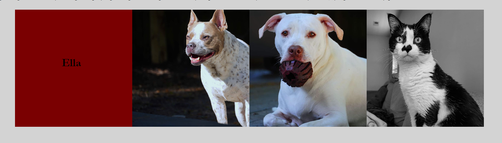

# Portfolio

## Description

I created my Portfolio so that potential employers can review my information in a single location. I learned how to set up contact links so that people can email me, call me, and view my GitHub profile. I also learned how flexbox works and how to utilize it so that images and text appear appropriately. Lastly, I learned how to make text appear in place of a picture. 

## Installation

One may install my project by going to my GitHub repository. Select to copy the HTTPS code and clone the link in GitBash. Use "code ." to open VS. From here, one may make edits to my project. To save the edits, simply utilize the add, commit, and push commands in GitBash to commit the changes. The commands are: 

1. git add -A
2. git commit -m "text comment"
3. git push origin main 

## Usage

My Portfolio allows people to contact me directly via phone, email, and to view my GitHub profile, simply by selecting the links in the CONTACT ME section. 

My Portfolio also allows people to get to know me via the small About Me section, and My Work section. In my About Me section, you can view pictures of my pets and hover over them to view their name. 

## Credits

I used assistance from the UNCC Tutor named Andres as well as assistance from AskBCS.

I used the below site for assistance with Flexbox: 
https://css-tricks.com/snippets/css/a-guide-to-flexbox/

